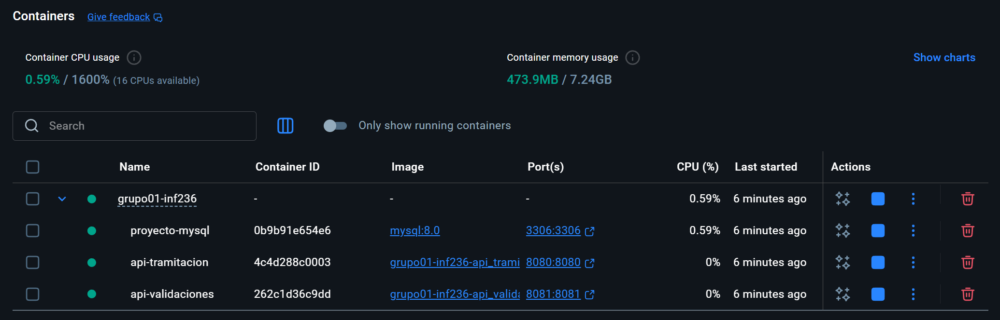
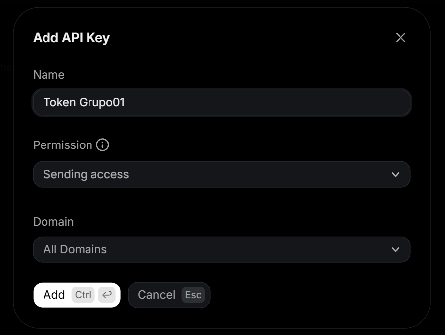

# Grupo 01 — Proyecto INF236 — Sistema de Préstamos

Este es el repositorio del *Grupo 01*, cuyos integrantes son:

* Catalina Muñoz - 202073030-K
* Emilia Faccilongo - 202204086-6
* Hans Gonzalez - 202373020-3
* Gonzalo Torrejón - 202373115-3
* Cristóbal Martínez - 202373090-4
* **Tutor**: Valentina Castillo 

---
<br> 


## Recursos del Proyecto

- [Wiki](https://gitlab.labcomp.cl/cfmunozr/grupo01-inf236/-/wikis/home)
- [Issues y Seguimiento](https://gitlab.labcomp.cl/cfmunozr/grupo01-inf236/-/issues)

---
<br> 


## Videos

* [Video Presentación Cliente](https://aula.usm.cl/pluginfile.php/7621199/mod_resource/content/2/video1352931478.mp4)
* [Video Segunda Reunión Cliente](https://drive.google.com/file/d/1X_r8pDOMemV8-iPtcfFoTjsE5H_7BTZU/view)
* [Video Resultado Final del Sistema](https://drive.google.com/file/d/1jiez2SYDgOw_cCja6LRnMiVHALWf2dfT/view?usp=sharing)

---
<br> 


## Levantamiento del Proyecto

### 🛠️ _Tecnologías_

- Node.js 18-alpine
- Express.js 4.x
- MySQL 8.0
- Docker & Docker Compose
- HTML5 + Bootstrap (Frontend)


### 📁 _Estructura del Proyecto_

```
grupo01-inf236/
├── docker-compose.yml             # Orquestación de servicios
├── init/
│   └── init.sql                   # Creación automática de bases de datos
├── API_TRAMITACION/
│   ├── Dockerfile                 # Imagen Docker API Tramitación
│   ├── index.js                   # Servidor Express
│   ├── package.json               # Dependencias Node.js
│   ├── .env.example               # Plantilla de configuración de variables de entorno
│   ├── init/
│   │   └── init.sql               # Script inicial de BD
│   ├── public/                    # Frontend HTML
│   │   ├── home.html              # Página de simulación
│   │   ├── antecedentes.html      # Formulario de solicitud
│   │   ├── exito.html             # Resultado exitoso
│   │   ├── rechazo.html           # Resultado rechazado
│   │   └── base.html              # Plantilla base
│   │   └── aprobacion_final.html 
│   │   └── rechazo_final.html  
│   └── src/
│       ├── db.js                  # Conexión a MySQL
│       ├── controllers/
│       │   └── index.js           # Lógica de negocio
│       └── routes/
│           └── index.js           # Rutas de la API
├── API_VALIDACIONES/
│   ├── Dockerfile                 # Imagen Docker API Validaciones
│   ├── index.js                   # Servidor Express
│   ├── package.json               # Dependencias Node.js
│   ├── .env.example               # Plantilla de configuración de variables de entorno
│   ├── init/
│   │   └── init.sql               # Script inicial de BD
│   └── src/
│       ├── db.js                  # Conexión a MySQL
│       ├── controllers/
│       │   └── index.js           # Lógica de negocio
│       └── routes/
│           └── index.js           # Rutas de la API
└── img/                           # Recursos gráficos para el README
    └── clase_UML.png
    └── contenedores_docker.png
    └── crear_key.png
```


### 📋 _Lineamientos de la Solución_

La solución desarrollada sigue los siguientes lineamientos:

* Se consideran dos APIs:
    * **API_TRAMITACION:** Con todo lo referido a los pasos de solicitud, evaluación y firmas de documentos.
        - Simulación de préstamos
        - Creación de solicitudes
        - Validación de admisibilidad
        - Gestión de estados de solicitudes
    * **API_VALIDACIONES:** Con todo lo referido a los procesos de activación, desembolso, cobranza y pagos de cuotas.
        - Activación de préstamos aprobados
        - Gestión de pagos y cuotas
        - Validaciones adicionales
        - Seguimiento de cobranza
* Cada API cuenta con una base de datos MySQL.
* Las bases de datos están en contenedores separados.
* Cada servicio está en un contenedor.
* El proyecto considera solo los servicios backend.


### 🚀 _Instalación y Configuración_

#### **Requisitos Previos**

| Herramienta                             | ¿Necesaria?  | ¿Para qué?                                      |
|-----------------------------------------|--------------|------------------------------------------|
| [**Docker**](https://www.docker.com/)   | Sí           | Ejecutar todo el proyecto (APIs + Base de datos) |
| [**Postman**](https://www.postman.com/) | Recomendada  | Probar los endpoints de las APIs             |


#### **Explicación Importante**

Este proyecto usa **Docker** para ejecutar todo. Al levantar los contenedores, este se encarga de:
- Instalar Node.js dentro del contenedor.
- Instalar todas las dependencias (`npm install`).
- Ejecutar las APIs (`node index.js`).
- Levantar MySQL.

> **Nota** 💡 \
[**Node.js**](https://nodejs.org/en) y [**Express**](https://expressjs.com/es/) son las tecnologías con las que están **construidas** las APIs.


#### **Pasos**

##### **_Paso 0. Configurar Archivos .env (IMPORTANTE)_**

**Opción 1: Copiar desde los ejemplos**

Desde la **carpeta principal del proyecto** (en este caso [`GRUPO01-INF-236`](./)), abrir una nueva terminal, y copiar y pegar los comandos:
```bash
cd API_TRAMITACION
cp .env.example .env
cd ../API_VALIDACIONES
cp .env.example .env
````


**Opción 2: Crear manualmente**

Crear archivo `.env` en [`API_TRAMITACION`](/API_TRAMITACION/) con el siguiente contenido:
```env
PORT_API = 8080
DB_USER = "root"
DB_PASSWORD = "password"
DB_NAME = "BD01_TRAMITACION"
DB_PORT = 3306
DB_HOST = "mysql"
```
Crear archivo `.env` en [`API_VALIDACIONES`](/API_VALIDACIONES/) con el siguiente contenido:
```env
PORT_API = 8081
DB_USER = "root"
DB_PASSWORD = "password"
DB_NAME = "BD01_VALIDACIONES"
DB_PORT = 3306
DB_HOST = "mysql"
```

##### **_Paso 1: Levantar Todos los Contenedores_**

En la terminal creada anteriormente, copiar y pegar los comandos:

**1.1.** Levantar MySQL y ambas APIs con:
```bash
docker compose up --build -d
```

> **Nota Importante** ⚠️ \
Es normal que se vean errores en los logs al principio (como "Cannot connect to database"). Esto sucede porque las APIs intentan conectarse mientras MySQL todavía se está inicializando. El healthcheck de Docker se encarga de esperar a que MySQL esté listo, y las APIs se conectarán automáticamente después de unos segundos.


**1.2.** Verificar que los contenedores estén corriendo con:
```bash
docker compose ps
```
Se deberían ver 3 contenedores:
- ✅ proyecto-mysql en el puerto 3306
- ✅ api-tramitacion en el puerto 8080
- ✅ api-validaciones en el puerto 8081

También se puede verificar directamente desde Docker Desktop:



**1.3.** Verificar que las bases de datos se hayan creado:
```bash
docker exec -it proyecto-mysql mysql -uroot -ppassword -e "SHOW DATABASES;"
```
Se deberían ver `BD01_TRAMITACION` y `BD01_VALIDACIONES` en la lista.


##### **_Paso 2: Inicializar las Tablas_**

**PowerShell**
```powershell
Invoke-WebRequest -Uri "http://localhost:8080/api/createTable" -Method GET
Invoke-WebRequest -Uri "http://localhost:8081/createTable" -Method GET
```

**Bash/Linux/Mac**
```bash
curl http://localhost:8080/api/createTable
curl http://localhost:8081/createTable
```

Se debería ver el mensaje:
```
{"message":"Tablas creadas correctamente"}
```


##### **_Paso 3: Verificación de Endpoints_**

**PowerShell:**
```powershell
Invoke-WebRequest -Uri "http://localhost:8080/api/" -Method GET
Invoke-WebRequest -Uri "http://localhost:8081/" -Method GET
```

**Bash/Linux/Mac:**
```bash
curl http://localhost:8080/api/
curl http://localhost:8081/
```

Se debería ver el mensaje:
```
{"message":"Probando... La prueba de 'API_Nombre' fue un éxito!"}
```


### ⚡ _Resumen de Comandos_

```bash
# 0. Crear archivos .env
cd API_TRAMITACION
cp .env.example .env
cd ../API_VALIDACIONES
cp .env.example .env
````
```bash
# 1. Levantar contenedores (las bases de datos se crean automáticamente):
docker compose up --build -d
```

```bash
# 2. Verificar estado de contenedores:
docker compose ps
```

```bash
# 3. Verificar creación de las bases de datos:
docker exec -it proyecto-mysql mysql -uroot -ppassword -e "SHOW DATABASES;"
```

```bash
# 4. Inicializar tablas:

# PowerShell
Invoke-WebRequest -Uri "http://localhost:8080/api/createTable" -Method GET
Invoke-WebRequest -Uri "http://localhost:8081/createTable" -Method GET

# Bash/Linux/Mac
curl http://localhost:8080/api/createTable
curl http://localhost:8081/createTable
```

```bash
# 5. Verificar que las APIs respondan:

# PowerShell
Invoke-WebRequest -Uri "http://localhost:8080/api/" -Method GET
Invoke-WebRequest -Uri "http://localhost:8081/" -Method GET

# Bash/Linux/Mac
curl http://localhost:8080/api/
curl http://localhost:8081/
```


### 🔧 _Troubleshooting_

#### **Problema 1: Las APIs no se conectan a la base de datos**
Solución: 
  - Verificar que los archivos `.env` existan en ambas carpetas de APIs.
  - Verificar que las bases de datos estén creadas con 
  ```bash
  `docker exec -it proyecto-mysql mysql -uroot -ppassword -e "SHOW DATABASES;"`
  ```
  - Revisar los logs con
  ```bash
  docker compose logs -f api_tramitacion`
  ```


#### **Problema 2: Error "cannot open file .env" o variables de entorno no definidas**

Solución: Revisar el **Paso 0** de la sección "🚀 _Instalación y Configuración_".


#### **Problema 3: Puerto ya en uso**

Solución: Detener los contenedores existentes con
```bash
docker compose down
```


#### **Problema 4: Cambios en el código no se reflejan**

Solución: Reconstruir los contenedores con
```bash
docker compose up --build -d
```


#### **Problema 5: Error "service depends on undefined service"**

Solución: Asegurarse de estar ejecutando `docker compose up` desde la carpeta principal del proyecto (donde está el `docker-compose.yml` principal).


#### **Problema 6: Las APIs se reinician constantemente**

Solución: 
  - Esperar unos segundos, MySQL puede tardar en inicializarse.
  - Verificar que las bases de datos existan.
  - Revisar los logs con
  ```bash
  docker compose logs api_tramitacion
  ```


### 🐳 _Comandos Docker Útiles_

**Ver el estado de los contenedores**
```bash
docker compose ps
```

**Ver logs de todos los servicios**
```bash
docker compose logs -f
```

**Ver logs de un servicio específico**
```bash
docker compose logs -f api_tramitacion
docker compose logs -f api_validaciones
docker compose logs -f mysql
```

**Detener todos los contenedores**
```bash
docker compose down
```

**Limpiar todo (contenedores, volúmenes y redes)**
```bash
docker compose down -v
docker system prune -f
```

**Reconstruir y reiniciar todos los contenedores**
```bash
docker compose up --build -d
```

**Reiniciar un servicio específico**
```bash
docker compose restart api_tramitacion
docker compose restart api_validaciones
```

---
<br> 


## Funcionamiento del Proyecto

### 📚 _Información de las APIs_

#### **API_TRAMITACION**
La API de trámites maneja:
- **Simulación de préstamos**: Cálculo de tasas de interés y cuotas.
- **Solicitudes**: Creación, gestión y notificación de resolución de solicitudes de préstamo.
- **Admisibilidad**: Validación automática de requisitos.

**Frontend:**
- Acceder a **http://localhost:8080** para ver la interfaz web.


#### **API_VALIDACIONES**
La API de validaciones maneja:
- **Activación**: Activación de préstamos aprobados.
- **Pagos**: Registro y seguimiento de pagos de cuotas.
- **Validaciones**: Validaciones adicionales post-aprobación.
- **Cobranza**: Seguimiento de cuotas pendientes.


### ✅ _Pruebas de Endpoints con Postman_

#### **¿Cómo Hacer Peticiones?**
**1. Crear una nueva petición:**
  - Hacer click en "New" → "HTTP Request".
  - Seleccionar el método (GET, POST, PUT, DELETE).
  - Ingresar la URL del endpoint.
   
**2. Para peticiones POST/PUT con JSON:**
  - Ir a la pestaña "Body".
  - Seleccionar "raw".
  - Seleccionar "JSON" en el dropdown.
  - Escribir el JSON en el editor.

**3. Hacer click en "Send"** para ejecutar la petición.

**4. Ver la respuesta** en la parte inferior.


### 🔄 _Flujo Completo del Sistema_

1. **Simulación**: Cliente simula un préstamo → `POST /api/simulacion` (API_TRAMITACION)
2. **Solicitud**: Cliente crea una solicitud con sus datos → `POST /api/solicitud` (API_TRAMITACION)
3. **Validación Automática**: Sistema valida admisibilidad automáticamente (API_TRAMITACION)
4. **Aprobación Manual**: Administrador aprueba la solicitud → `PUT /api/solicitud/:id/estado` (API_TRAMITACION)
5. **Activación**: Se activa el préstamo y se crean las cuotas → `POST /prestamo/activar` (API_VALIDACIONES)
6. **Pagos**: Cliente realiza pagos de cuotas → `POST /pago` (API_VALIDACIONES)


### 📝 _Uso del Sistema (Interfaz Web)_

API_TRAMITACION incluye una interfaz web completa para simular y solicitar préstamos. Esta es la forma más sencilla de probar el sistema sin necesidad de usar Postman.

> **Nota** 💡 \
Si se desea probar la funcionalidad de recibir notificaciones vía correo, seguir los pasos detallados en:
[📧 _HU05. Notificar Resolución_](#-hu05-notificar-resolución)

#### **Acceso al Frontend**

1. Abrir navegador de preferencia.
2. Acceder a **http://localhost:8080**


#### **Flujo Completo con el Frontend**

##### **_1. Página de Simulación (`/` o `/home.html`)_**
Página principal donde los clientes pueden simular un préstamo.

**Pasos**
1. Ingresar el monto solicitado ($2.000.000-$80.000.000 CLP).
2. Ingresar el **plazo en meses** (6-60 meses).
3. Hacer click en **Simular**, donde se deplegará la siguiente información:
  - Tasa de interés anual aplicada.
  - Valor de la cuota mensual.
  - Tabla de amortización.
4. Hacer click en **"Continuar a confirmación"** para ver los términos y condiciones.
5. Aceptar las condiciones.

##### **_2. Página de Antecedentes (`/antecedentes.html`)_**
Página donde se realiza el formulario de solicitud.

**Pasos**
1. Completar el formulario con datos personales y financieros.
2. Subir los documentos requeridos:
   - Liquidación de sueldo (PDF/JPG, max 5MB).
   - Cédula de identidad (PDF/JPG, max 5MB).
3. Enviar la solicitud, luego de lo que el sistema validará automáticamente la admisibilidad.
> **Nota Importante** ⚠️ \
Al momento de realizar la solicitud, ingresar el correo con el que se registró la cuenta en [**Resend**](https://resend.com).

##### **_3. Páginas de Resultado_**
Según el resultado de la validación, el sistema redirigirá a:
- **`/exito.html`**: Si se cumplen todos los requisitos de admisibilidad.
  - Estado de solicitud: **PENDIENTE**.
  - Mensaje: "Tu solicitud fue creada exitosamente"
- **`/rechazo.html`**: Si no se cumple algún requisito.
  - Estado de solicitud: **RECHAZADO_ADMISIBILIDAD**.
  - Se muestran las razones del rechazo.

> **Nota** 💡 \
Después de crear solicitudes desde el frontend, pueden verificarse utilizando Postman.

---
<br> 


## Historias de Usuario

### ✒️ _Notaciones_

Respecto a los issues, se destaca lo siguiente:
* Todos los actores se encuentran identificados por comenzar con letra mayúscula (Por ej. Cliente, Institución Financiera, Medios de Comunicación, etc).
* Siempre que se refiera a una de las empresas externas a la Institución Financiera, se mencionará al actor seguido de la palabra _asociado/a(s)_.


### 🏷️ _Etiquetas_

Hacen referencia al estado en el que se encuentra la implementación de la HU correspondiente, clasificándose en:
* 🔴 [**Por Iniciar**](https://gitlab.labcomp.cl/cfmunozr/grupo01-inf236/-/issues?label_name[]=Por%20Iniciar): Aún no se comienza su implementación.
* 🟡 [**En Proceso**](https://gitlab.labcomp.cl/cfmunozr/grupo01-inf236/-/issues?label_name[]=En%20Proceso): En proceso de implementación.
* 🟢 [**Listo**](https://gitlab.labcomp.cl/cfmunozr/grupo01-inf236/-/issues?label_name[]=Listo): Implementación terminada.


### 📌 _Elección de HUs Principales_

Las HUs más relevantes se escogieron en base a todos los pasos que comprende la **realización de una solicitud de préstamo**, ya que sin el envío de una, no existiría ninguno de los pasos que le siguen, como la firma de documentos, emisión del dinero y pago de cuotas.

Cabe destacar que el paso de simulación será de carácter obligatorio para la realización de solicitudes, pues se busca que la empresa destaque por su *transparencia* respecto a sus tasas de interés, plazos de pago, límites crediticios y términos generales a la hora de postular a créditos de consumo.
Es por lo anterior, que las HU escogidas son las siguientes:
* **HU01. Simular Préstamo**: Se refiere a todo lo relativo al simulador del sistema.
* **HU02. Confirmar Condiciones**: Se refiere al paso intermedio entre la simulación y la solicitud, donde se le reitera al Cliente toda la información del préstamo que planea solicitar, fomentando la *transparencia*.
* **HU03. Realizar Solicitud**: Se refiere a todo lo relativo a la entrega de información para la solicitud.


### 📧 _HU05. Notificar Resolución_

Esta historia de usuario implementa la funcionalidad de notificar vía correo el resultado de la solicitud.

#### **_Configuración para Notificaciones por Correo_**

Para utilizar la funcionalidad se deben realizar los siguientes pasos previos:

1. Acceder a **http://resend.com**
2. Crear una cuenta utilizando el mail en el que se desee recibir las notificaciones.
3. Desde el menú lateral, dirigirse a `🔒API Keys`.
4. Seleccionar `+ Create API Key`, darle un nombre y permiso 'Sending access'.

5. Copiar el token entregado.
6. Dirigirse al archivo [`/API_TRAMITACION/src/controllers/index.js`](./API_TRAMITACION/src/controllers/index.js).
7. En la línea 6, modificar la variable `resend`, pegando la API key obtenida.

---
<br>


## Supuestos de la Institución Financiera

Corresponde a un banco pequeño o mediano, con una base de clientes establecida, que busca digitalizar sus procesos de contratación de préstamos de consumo, ofreciendo una experiencia ágil, transparente y rápida, similar a la de las fintechs líderes del mercado.\
Cabe destacar que cada Cliente (identificado por su RUT único) solo puede mantener una única solicitud activa en el sistema.

### 💰 _Capital_

La Institución Financiera cuenta con un capital estimado de **1.000.000 UF**, lo que permite otorgar créditos de consumo sin comprometer su estabilidad operativa.


### 🧮 _Simulador_

La simulación de préstamo permite al Cliente explorar condiciones preliminares antes de iniciar una solicitud formal.\
Los valores definidos a continuación se basan en prácticas habituales del mercado chileno, considerando los supuestos mencionados anteriormente.

#### **1. Límites de Monto**
Se define un rango que permite cubrir desde necesidades básicas hasta la consolidación de deudas o proyectos personales, sin comprometer la estabilidad de la Institución Financiera.

> **Mínimo**: $2.000.000 CLP (alrededor de las 50 UF).

> **Máximo**: $80.000.000 CLP (alrededor de las 2025 UF).


#### **2. Límites de Cuotas**
Se definen plazos alineados con la práctica habitual en Chile para créditos de consumo, excluyendo créditos hipotecarios o automotrices.

> **Mínimo**: 6 cuotas.

> **Máximo**: 60 cuotas.


### 🔍 _Evaluación de Admisibilidad_

Es realizada automáticamente por el sistema, en base exclusivamente a los datos personales y documentos entregados por el Cliente en el formulario digital (aún no se consideran antecedentes provenientes de fuentes externas ni puntaje scoring).\
Las reglas de admisibilidad descritas a continuación permiten verificar rápidamente si la solicitud puede formalizarse y pasar a ser revisada.

#### **1. Requisitos de Identificación**
> **1.1.** Cédula de identidad vigente (chilena o extranjera con residencia definitiva).

> **1.2.** Ser mayor de edad (18 años o más al momento de la solicitud).


#### **2. Requisitos de Residencia**
> **2.1.** Domicilio en Chile, con dirección completa.


#### **3. Requisitos de Ingresos**
> **3.1.** Declaración de ingresos líquidos mensuales por parte del Cliente.

> **3.2.** Acreditación de ingresos regulares mediante al menos uno de los siguientes documentos:
> * Últimas 3 liquidaciones de sueldo (dependientes).
> * Boletas de honorarios o declaración de renta (independientes).
> * Certificado de pensión (jubilados).


#### **4. Reglas de Endeudamiento**
> **4.1.** El monto solicitado no debe superar entre el 30% y el 40% de los ingresos líquidos declarados.

---
<br> 


## Documentación de Donde se Basó el Proyecto

* [Presentación Cliente](https://aula.usm.cl/pluginfile.php/7607145/mod_resource/content/0/PROYECTO%20USM%20AGOSTO%202025%202.pdf)
* [Tesis Universidad de Chile](https://repositorio.uchile.cl/bitstream/handle/2250/176305/An%C3%A1lisis-de-factibilidad-estrat%C3%A9gica-t%C3%A9cnica-y-econ%C3%B3mica-para-el-desarrollo-de-un-modelo-de-colocaciones-de-cr%C3%A9ditos.pdf?sequence=1)

---
